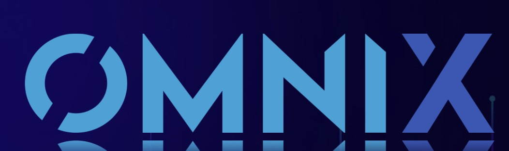

# OmniX Payroll - On-chain Payroll Platform

OmniX is a decentralized, private on-chain payroll system that empowers Layer 2 ecosystems and solves the real-world problems related to lack of applications like payroll, card payments, and high entry barriers via on/off-ramps.

## Table of Contents

- [Overview](#overview)
- [Features](#features)
- [Architecture](#architecture)
- [Workflow](#workflow)
- [Roadmap](#roadmap)
- [Contact](#contact)

## Overview

OmniX provides a win-win solution for Layer2, employers, and employees. In OmniX, businesses can privately automate employee salaries, manage contractor payments, generate P&Ls, treasury balance, spending, net value, etc. and conveniently on and off ramp into fiat currencies and bank accounts.

## Features

- **Private On-Chain Payroll**: OmniX uses a ZK settlement mechanism allowing employers to distribute crypto earnings without revealing treasury or salary details.
- **Multi-Chain**: OmniX is designed to work across multiple chains, providing flexibility and expanded reach.
- **On/Off Ramps**: OmniX provides on/off ramps to traditional financial services, enabling the practical utility of crypto payroll in real-world applications.

## Architecture

Our solution shields the original naked income data from the chains, adding the missing piece to the puzzle of a current decentralized crypto payroll system. We design three contracts as the fundamental cornerstone for the whole mechanism:

- **HR Contract**: Handles operations related to depositing salaries, initiating transfer, and updating hash values.
- **Employee Contract**: Handles operations related to verifying deposits and claiming salary.
- **Privacy-Enhanced Contract**: Handles operations related to encrypting and decrypting salary amounts, and verifying Zero-Knowledge Proofs.

*OmniX Architecture Figure Here (TODO)*
<!--  -->

## Workflow

The workflow of the Privacy-Enhanced Contract includes setting up a PEC account, funding the account, making confidential transfers, and withdrawing funds.

*OmniX Workflow Figure Here (TODO)*
<!--  -->

## Contact

Follow our updates and join the conversation:

- **Telegram**: @andrew_capasso 

Please note that this project is in early development stage. We encourage developers to explore, contribute, and provide feedback to help us improve.